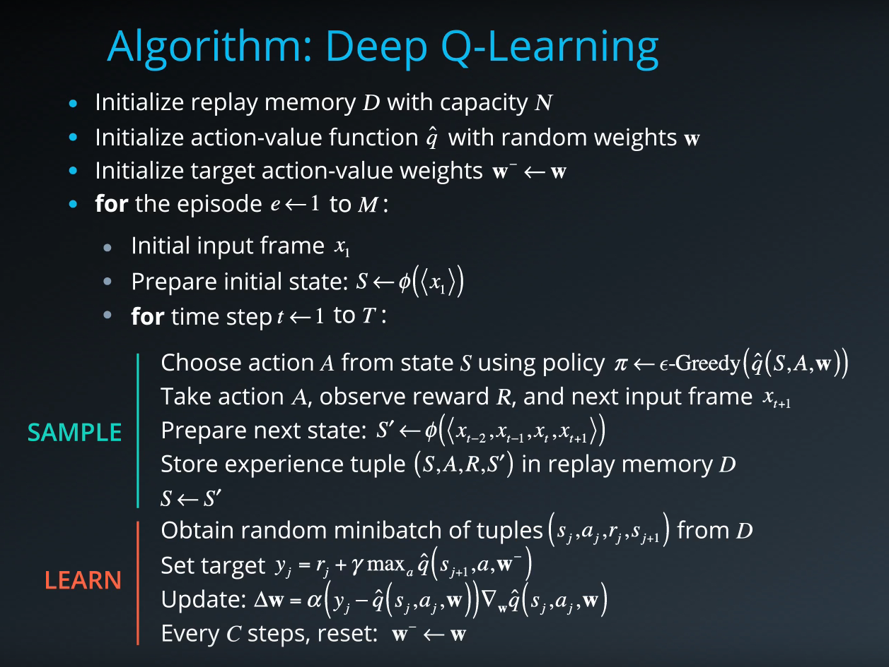
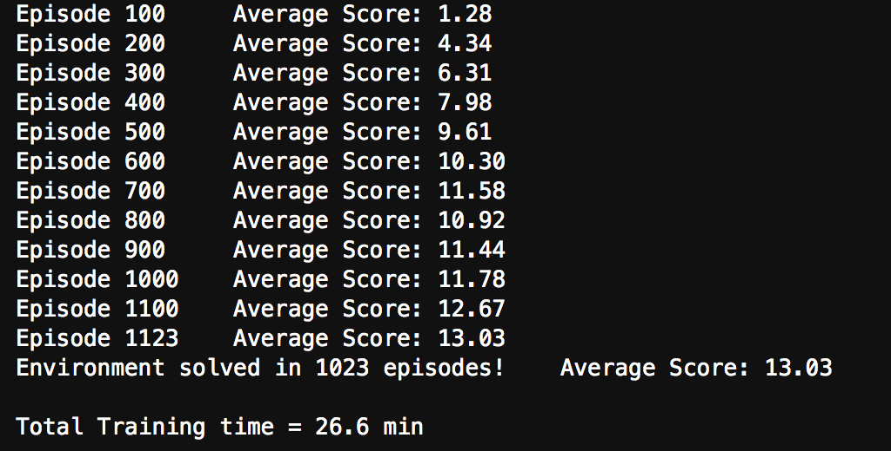
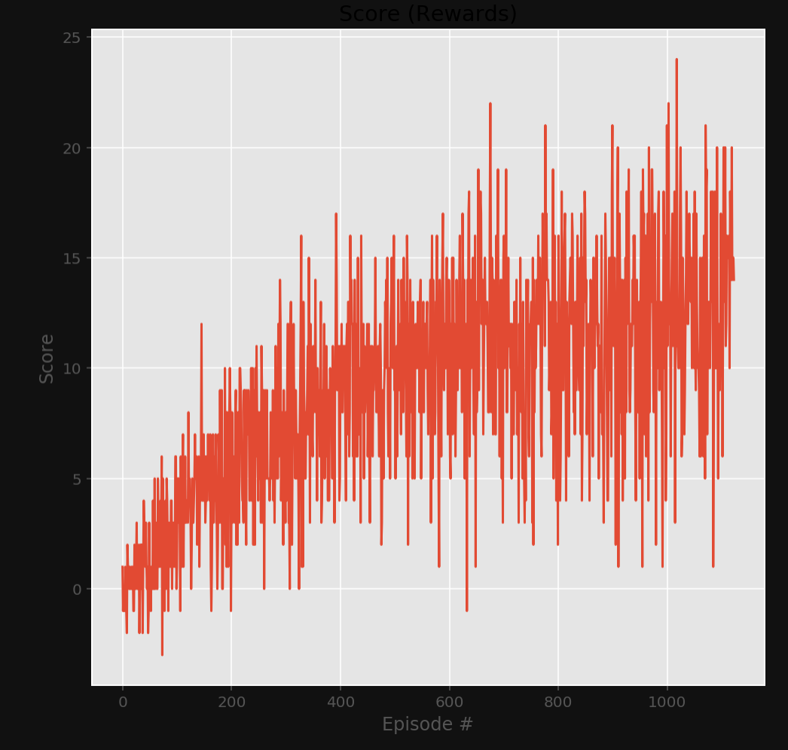

# Banana Frenzy Agent

## Project's goal

In this project, **the goal is to train an agent to navigate a virtual world and collect as many yellow bananas as possible while avoiding blue bananas**


## Environment details

The environment is based on [Unity ML-agents](https://github.com/Unity-Technologies/ml-agents)

Note: The project environment provided by Udacity is similar to, but not identical to the Banana Collector environment on the Unity ML-Agents GitHub page.

> The Unity Machine Learning Agents Toolkit (ML-Agents) is an open-source Unity plugin that enables games and simulations to serve as environments for training intelligent agents. Agents can be trained using reinforcement learning, imitation learning, neuroevolution, or other machine learning methods through a simple-to-use Python API. 

A reward of +1 is provided for collecting a yellow banana, and a reward of -1 is provided for collecting a blue banana. Thus, the goal of the agent is to collect as many yellow bananas as possible while avoiding blue bananas.

The state space has 37 dimensions and contains the agent's velocity, along with ray-based perception of objects around the agent's forward direction. 

Given this information, the agent has to learn how to best select actions. Four discrete actions are available, corresponding to:

- 0 - move forward.
- 1 - move backward.
- 2 - turn left.
- 3 - turn right.

The task is episodic, and **in order to solve the environment, the agent must get an average score of +13 over 100 consecutive episodes.**


## Agent Implementation

### Deep Q-Networks

This project implements a *Value Based* method called [Deep Q-Networks](https://deepmind.com/research/dqn/). 

Deep Q Learning combines 2 approaches :
- A Reinforcement Learning method called [Q Learning](https://en.wikipedia.org/wiki/Q-learning) (aka SARSA max)
- A Deep Neural Network to learn a Q-table approximation (action-values)

Especially, this implementation includes the 2 major training improvements by [Deepmind](https://deepmind.com) and described in their [Nature publication : "Human-level control through deep reinforcement learning (2015)"](https://storage.googleapis.com/deepmind-media/dqn/DQNNaturePaper.pdf)
- Experience Replay 
- Fixed Q Targets

> Reinforcement learning is known to be unstable or even to diverge when a nonlinear function approximator such as a neural network is used to represent the action-value (also known as Q) function20. This instability has several causes: the correlations present in the sequence of observations, the fact that small updates to Q may significantly change the policy and therefore change the data distribution, and the correlations
between the action-values and the target values .
We address these instabilities with a novel variant of Q-learning, which uses two key ideas. First, we used a biologically inspired mechanism termed experience replay that randomizes over the data, thereby removing correlations in the observation sequence and smoothing over changes in the data distribution. Second, we used an iterative update that adjusts the action-values towards target values that are only periodically updated, thereby reducing correlations with the target.

### Algorithm



This algorithm screenshot is taken from the [Deep Reinforcement Learning Nanodegree course](https://www.udacity.com/course/deep-reinforcement-learning-nanodegree--nd893)


### Code implementation

The code used here is derived from the "Lunar Lander" tutorial from the [Deep Reinforcement Learning Nanodegree](https://www.udacity.com/course/deep-reinforcement-learning-nanodegree--nd893), and has been slightly adjusted for being used with the banana environment.

The code consist of :

- model.py : In this python file, a PyTorch QNetwork class is implemented. This is a regular fully connected Deep Neural Network using the [PyTorch Framework](https://pytorch.org/docs/0.4.0/). This network will be trained to predict the action to perform depending on the environment observed states. This Neural Network is used by the DQN agent and is composed of :
  - the input layer which size depends of the state_size parameter passed in the constructor
  - 2 hidden fully connected layers of 1024 cells each
  - the output layer which size depends of the action_size parameter passed in the constructor
- dqn_agent.py : In this python file, a DQN agent and a Replay Buffer memory used by the DQN agent) are defined.
  - The DQN agent class is implemented, as described in the Deep Q-Learning algorithm. It provides several methods :
    - constructor : 
      - Initialize the memory buffer (*Replay Buffer*)
      - Initialize 2 instance of the Neural Network : the *target* network and the *local* network
    - step() : 
      - Allows to store a step taken by the agent (state, action, reward, next_state, done) in the Replay Buffer/Memory
      - Every 4 steps (and if their are enough samples available in the Replay Buffer), update the *target* network weights with the current weight values from the *local* network (That's part of the Fixed Q Targets technique)
    - act() which returns actions for the given state as per current policy (Note : The action selection use an Epsilon-greedy selection so that to balance between *exploration* and *exploitation* for the Q Learning)
    - learn() which update the Neural Network value parameters using given batch of experiences from the Replay Buffer. 
    - soft_update() is called by learn() to softly updates the value from the *target* Neural Network from the *local* network weights (That's part of the Fixed Q Targets technique)
  - The ReplayBuffer class implements a fixed-size buffer to store experience tuples  (state, action, reward, next_state, done) 
    - add() allows to add an experience step to the memory
    - sample() allows to randomly sample a batch of experience steps for the learning       
- DQN_Banana_Navigation.ipynb : This Jupyter notebooks allows to train the agent. More in details it allows to :
  - Import the Necessary Packages 
  - Examine the State and Action Spaces
  - Take Random Actions in the Environment (No display)
  - Train an agent using DQN
  - Plot the scores

### DQN parameters and results

The DQN agent uses the following parameters values (defined in dqn_agent.py)

```
BUFFER_SIZE = int(1e5)  # replay buffer size
BATCH_SIZE = 64         # minibatch size 
GAMMA = 0.995           # discount factor 
TAU = 1e-3              # for soft update of target parameters
LR = 5e-4               # learning rate 
UPDATE_EVERY = 4        # how often to update the network
```

The Neural Networks use the following architecture :

```
Input nodes (37) -> Fully Connected Layer (1024 nodes, Relu activation) -> Fully Connected Layer (1024 nodes, Relu activation) -> Ouput nodes (4)
```

The Neural Networks use the Adam optimizer with a learning rate LR=5e-4 and are trained using a BATCH_SIZE=64

Given the chosen architecture and parameters, our results are :





**These results meets the project's expectation as the agent is able to receive an average reward (over 100 episodes) of at least +13, and in 1023 episodes only** (In comparison, according to Udacity's solution code for the project, their agent was benchmarked to be able to solve the project in fewer than 1800 episodes)

### Ideas for future work

As discussed in the Udacity Course, a further evolution to this project would be to train the agent directly from the environment's observed raw pixels instead of using the environment's internal states (37 dimensions)

To do so a [Convolutional Neural Network](https://en.wikipedia.org/wiki/Convolutional_neural_network) would be added at the input of the network in order to process the raw pixels values (after some little preprocessing like rescaling the image size, converting RGB to gray scale, ...)

Other enhancements might also be implemented to increase the performance of the agent:
- [Double DQN](https://arxiv.org/abs/1509.06461)
> The popular Q-learning algorithm is known to overestimate action values under certain conditions. It was not previously known whether, in practice, such overestimations are common, whether they harm performance, and whether they can generally be prevented. In this paper, we answer all these questions affirmatively. In particular, we first show that the recent DQN algorithm, which combines Q-learning with a deep neural network, suffers from substantial overestimations in some games in the Atari 2600 domain. We then show that the idea behind the Double Q-learning algorithm, which was introduced in a tabular setting, can be generalized to work with large-scale function approximation. We propose a specific adaptation to the DQN algorithm and show that the resulting algorithm not only reduces the observed overestimations, as hypothesized, but that this also leads to much better performance on several games.
- [Dueling DQN](https://arxiv.org/abs/1511.06581)
> In recent years there have been many successes of using deep representations in reinforcement learning. Still, many of these applications use conventional architectures, such as convolutional networks, LSTMs, or auto-encoders. In this paper, we present a new neural network architecture for model-free reinforcement learning. Our dueling network represents two separate estimators: one for the state value function and one for the state-dependent action advantage function. The main benefit of this factoring is to generalize learning across actions without imposing any change to the underlying reinforcement learning algorithm. Our results show that this architecture leads to better policy evaluation in the presence of many similar-valued actions. Moreover, the dueling architecture enables our RL agent to outperform the state-of-the-art on the Atari 2600 domain.

- [Prioritized experience replay](https://arxiv.org/abs/1511.05952)
> Experience replay lets online reinforcement learning agents remember and reuse experiences from the past. In prior work, experience transitions were uniformly sampled from a replay memory. However, this approach simply replays transitions at the same frequency that they were originally experienced, regardless of their significance. In this paper we develop a framework for prioritizing experience, so as to replay important transitions more frequently, and therefore learn more efficiently. We use prioritized experience replay in Deep Q-Networks (DQN), a reinforcement learning algorithm that achieved human-level performance across many Atari games. DQN with prioritized experience replay achieves a new state-of-the-art, outperforming DQN with uniform replay on 41 out of 49 games.


### Misc : Configuration used 

This agent has been trained on the Udacity provided online workspace. This environment allows to use a Nvidia K80 GPU that is used for the training. (The headless / no visualization version of the Unity environment was thus used)

My setup is a "Deep Learning Dev Box", and is basically a Linux GPU Server, running Docker containers (using Nvidia Docker 2), serving Jupyter Lab notebooks which are accessed remotely via a web interface (or a ssh connection) : unfortunately this setup does not seem suitable to run Unity ML agent, with the GPU and providing a display for for the agent (See [Unity docuementation](https://github.com/Unity-Technologies/ml-agents/blob/master/docs/Using-Docker.md) for more details)